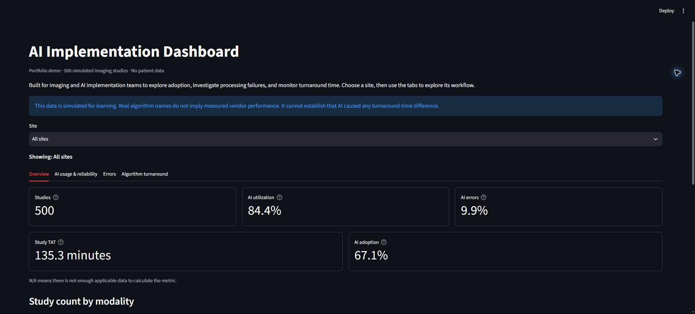

# Simulated Imaging-AI Implementation Dashboard

A Python, SQL, and Streamlit portfolio project for exploring how an imaging-AI
implementation team could monitor study volume, utilization, failures, adoption,
and turnaround time across three sites.

**All 500 studies are synthetic. No patient data is used. Product names are real
examples; every timing, error, and usage statistic is simulated. This project
is not a clinical tool, vendor evaluation, or demonstration of AI effectiveness.**



## What you can explore

The Site filter applies across four tabs:

| Tab | What it answers |
|---|---|
| Overview | How many studies are moving through the workflow, and what are the overall metrics? |
| AI usage & reliability | What share of eligible studies uses AI, and how do the counts differ by modality? |
| Errors | Which studies failed processing, and what fictional workflow reason was assigned? |
| Algorithm turnaround | What are the simulated AI processing and study TATs for a selected algorithm? |

Click a cell in the failed-studies table to read its explanation, or type/paste
a Study ID into the lookup. The lookup clears after selection while the explanation
remains visible. Algorithm lookup displays two TAT cards with sample sizes and
an alphabetical comparison table. Metric tooltips and an expandable explanation
section keep definitions accessible.

## Run locally

Use Python 3.11 or newer. From the project folder:

```powershell
python -m venv .venv
.venv\Scripts\Activate.ps1
python -m pip install -r requirements.txt
python src/load_to_sqlite.py
python src/validate_data.py
python -m streamlit run src/app.py
```

Open the local URL printed in the terminal. Keep the terminal running, and use
Ctrl+C to stop the app. If PowerShell blocks environment activation, use
`.venv\Scripts\python.exe` in place of `python` in the remaining commands.
Restart Streamlit after changing imported Python functions if refresh alone
does not pick up the changes. Streamlit 1.55+ is required for checkbox-free cell
selection; `requirements.txt` declares this dependency.

## Keep the hosted demo active

The GitHub Actions workflow in `.github/workflows/keep-streamlit-awake.yml`
requests the public dashboard every six hours. It is already configured for the
current public demo URL. This is a best-effort way to reduce cold starts on a
hosted demo; hosting providers can still pause or delay an app according to
their own policies.

If the deployment URL changes, replace the `STREAMLIT_APP_URL` value in that
workflow. Commit and push the workflow, then open the repository's **Actions**
tab. Choose **Keep Streamlit app awake**, select **Run workflow**, and confirm
its log says the request received HTTP 200. Scheduled checks then run every six
hours.

The repository includes a small synthetic CSV and a ready-to-read SQLite
snapshot. Loading the CSV rebuilds that snapshot; it does not generate new
studies. Dashboard queries open SQLite read-only and pass site selections as SQL
parameters. Paths are based on the scripts' location.

## Metric definitions

| Metric | Definition and population |
|---|---|
| Studies | All study rows in the selected scope, regardless of AI participation |
| AI utilization | Eligible studies processed by AI / all eligible studies x 100 |
| AI error rate | AI-processed studies with a workflow error / AI-processed studies x 100 |
| AI adoption | Studies where AI was used / studies with an available AI result x 100 |
| Study TAT | Average study start to completion, in minutes |
| Algorithm AI processing TAT | Average AI start to result for that algorithm's successful results only |
| Algorithm study TAT | Average study start to completion for that algorithm's processed studies, including errors |

Percentages and averages display one decimal place. Missing denominators or
qualifying timings produce NULL (displayed as N/A on the dashboard), not zero.
Study TAT does **not** mean order-to-read or exam-completion-to-final-report time.
The algorithm table shows the sample sizes used for its two averages.

## Data model and simulation assumptions

One `imaging_studies` table contains 500 studies from Central Hospital, North
Clinic, and South Imaging Center. It covers CT, MRI, Ultrasound, and X-ray.
Each eligible study has at most one algorithm assignment. The CSV catalog in
`data/ai_algorithms.csv` records product names, broad tasks, protocol matches,
source links, and the source-check date.

- Protocol/algorithm matches are deliberately simplified, not complete clinical
  indications, scanner requirements, or deployment rules.
- Each eligible study has an invented 85% probability of AI processing. A
  processed study has a 6% chance of a workflow error. A successful available
  result has a 72% chance of use. Actual sample percentages vary.
- AI starts 1-12 minutes after study start. Successful processing takes 0.5-15
  minutes. All products share these invented distributions.
- Study completion times are generated independently of the algorithm. The
  simulation does not model an AI-caused improvement or delay.
- Error explanations are repeatable fictional scenarios: incomplete series,
  missing metadata, timeout, service unavailability, or unreadable images.
  They are not conclusions from logs or measurements of diagnostic accuracy.

The fixed seeds make regeneration repeatable. Different clinical tasks and
small samples mean the algorithm averages cannot rank vendors. There is no
real patient-level dataset, production integration, clinical validation,
or causal evaluation in this project.

## Product-name sources

Names and broad task descriptions were checked September 18, 2026. No published
vendor performance statistics were used in the mock data.

| Examples | Official source |
|---|---|
| Aidoc ICH | [Aidoc neurovascular solutions](https://www.aidoc.com/solutions/neuro/) |
| Aidoc PE | [Aidoc VTE solutions](https://www.aidoc.com/solutions/vte-solutions/) |
| Viz ICH | [Viz indications for use](https://www.viz.ai/indications-for-use) |
| Viz PE | [Viz PE clinical-solution description](https://www.viz.ai/news/new-clinical-data-supports-viz-ai-solution-for-improved-pulmonary-embolism-detection-and-care-coordination) |
| Rapid ICH | [RapidAI product announcement](https://www.rapidai.com/press-release/rapid-platform-expands-to-address-hemorrhagic-stroke) |
| Rapid ASPECTS | [RapidAI product announcement](https://www.rapidai.com/press-release/rapid-aspects-first-neuroimaging-solution-with-cadx-fda-clearance) |
| icobrain ms | [icometrix MS solution](https://www.icometrix.com/multiple-sclerosis) |

These examples are not a definitive list of the best products. Product names
belong to their respective owners; their inclusion does not imply endorsement.
The same source links are accessible within the Algorithm turnaround tab.

## Validate the project

```powershell
python src/validate_data.py
python -m unittest discover -s tests -v
```

The read-only validator checks:

- Unique IDs, valid flags, and matching algorithm/protocol assignments.
- Timestamp order and consistency with processing, results, and adoption.
- An explanation for every failure, and none on successful/unprocessed studies.
- CSV/SQLite agreement and database integrity.
- All standalone reports and independent calculations of their overall and
  site-filtered metrics, chart counts, error lists, and algorithm TATs.
- Empty-selection behavior and undefined metrics.

Negative tests deliberately introduce invalid data in memory to prove the
validator catches duplicate IDs, missing reasons, reversed timestamps,
ineligible processing, and incorrect algorithm matches. Neither command modifies
the active data. Browser interactions also require a visual smoke check:

1. Switch sites and confirm that all four tabs follow the selection.
2. Select an algorithm and check the two cards against its table row.
3. Click a failed-study cell, then use the lookup; confirm the explanation changes
   and the search field clears while the selected explanation remains.

## Other commands

Print all five overall metrics:

```powershell
python src/summarize_metrics.py
```

Run a standalone report (substitute any file from `sql/`):

```powershell
python src/run_sql_file.py sql/06_algorithm_turnaround.sql
```

| SQL file | Report |
|---|---|
| `01_studies_processed.sql` | Total, daily, and site/modality volume |
| `02_ai_utilization.sql` | Eligible/processed counts and utilization |
| `03_ai_error_rate.sql` | Processed counts, errors, and error rate |
| `04_turnaround_time.sql` | Study TAT overall, by site/modality, and by AI status |
| `05_ai_adoption.sql` | Available/used counts and adoption |
| `06_algorithm_turnaround.sql` | Algorithm counts, errors, and both TAT averages |

To regenerate synthetic data, then rebuild SQLite:

```powershell
python src/generate_mock_data.py
python src/load_to_sqlite.py
python src/validate_data.py
```

`src/add_algorithm_data.py` can enrich an existing study CSV while preserving
its study IDs and study start/completion times. Regeneration/enrichment backs up
the current CSV and database under `data/backups/` before replacing data.

## Project structure and repository hygiene

- `src/`: mock-data generation, read-only loaders, dashboard, and validator.
- `sql/`: commented metric queries shared with the dashboard.
- `data/`: synthetic CSV, algorithm catalog, and the small demo SQLite snapshot.
- `tests/`: negative validation tests.
- `docs/`: actual dashboard screenshots.

Local backups, Python caches, virtual environments, working files, outputs,
and secrets are excluded by `.gitignore`. Local backup/cache copies remain on
disk. The active synthetic CSV and demo database are intentionally included so
someone can run the example easily. This cleanup does not rewrite Git history.

## What this project demonstrates

Python data preparation, SQL aggregation and denominator selection, safe SQLite
queries, shared metric logic, Streamlit interaction design, and repeatable data
validation applied to an imaging-informatics workflow. Development was assisted
by Codex as a learning project, with iterative review of calculations and UI.
The project demonstrates an analytics implementation, not proven clinical gains.
